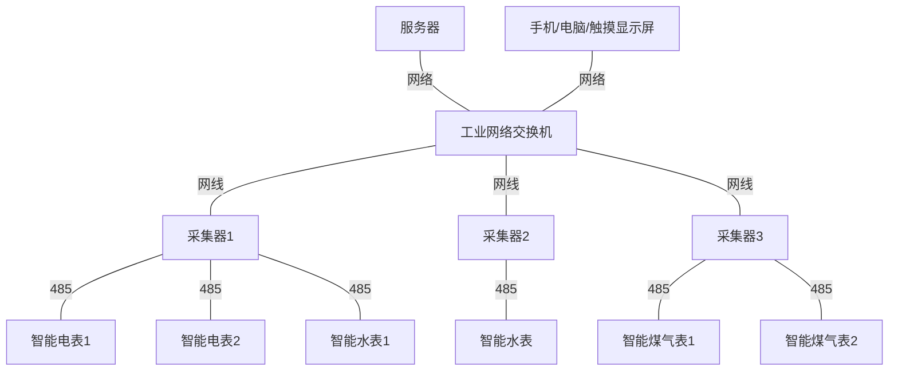

# 能源管理开发需求

## 系统架构

- 服务器
  - 可以部署在交换机组成的局域网内，也可以部署在阿里云服务器上
  - 通过tcp modbus读写设备数据
  - 提供可供访问的Web平台
  - 提供标准OPC接口
  - UI界面兼容电脑端和手机端
- 采集器
  - 串口服务器，485 modbus转tcp modbus
  - 配置485波特率，tcp端口等
- 智能设备
  - 智能水表、电表、煤气表等
  - 485接口，modbus协议

## Web平台

### 层级目录

- 首页
  - 能源总览
  - 电子地图
- 用户管理（**管理员**）
  - 用户名、密码
  - 权限
    - 管理员
    - 主管
    - 操作员
- 个人信息
  - 修改密码
- 日志管理（**管理员**）
  - 单个删除、批量删除
  - 日期查询
  - 类型查询
    - 登录
    - 退出
    - 增删改（网络拓扑）
    - 打印
    - 导出
- 设备管理（**管理员**）
  - 采集器
    - 选择楼层-子区域
    - 名字
    - IP端口
  - 设备
    - 选择采集器
    - 选择功能
    - 选择厂家型号（写死在后台）
    - 设置报警阈值（存在默认值）
  - 网络拓扑图
    - 通讯测试，测试每个节点的状态
- 实时数据
  - 实时数据
  - 历史数据
  - 实时告警
- 能效分析
  - 系统能流图
  - 分区能效
  - 同比分析
- 报表管理
  - 日报表
  - 周报表
  - 月报表
  - 年报表

